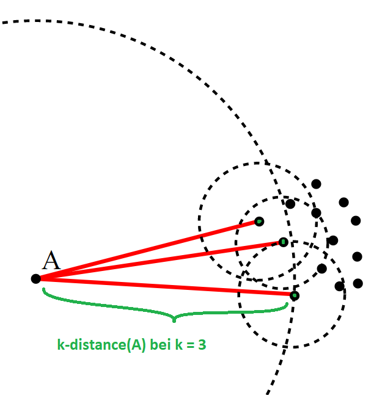
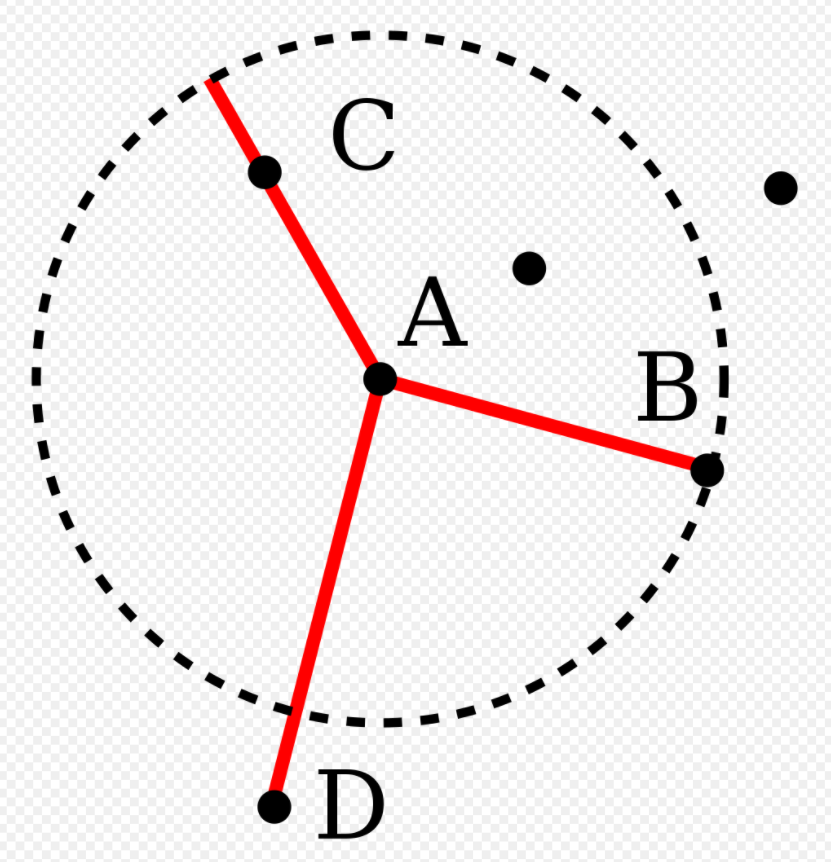
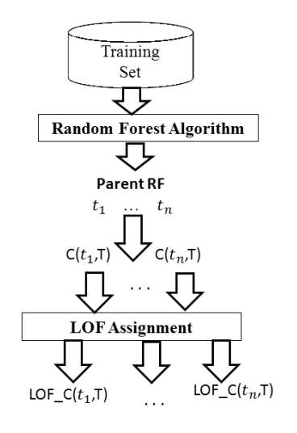

# Local Outlier Factor (LOC)

Ein Algorithmus zur Erkennung von Ausreissern, basierend auf der Dichte der Verteilung.
!Zum groessten Teil aus dem deutschen Wikipedia Artikel zum Local Outlier Factor kopiert.!

Ein Punkt, der „dichter“ ist als seine Nachbarn, befindet sich in einem Cluster.
Ein Punkt mit einer deutlich geringeren Dichte als seine Nachbarn ist hingegen ein Ausreisser.

## k-distance(A)

Die k-distance(A) ist die maximale Distanz des Objektes __A__ zu seinem k nächsten Nachbarn.
\
Diese Menge kann gegebenenfalls mehr als k Objekte enthalten,
wenn es mehrere Objekte mit dem gleichen Abstand gibt.
Wir bezeichnen diese „k-Nachbarschaft“ hier mit __N__k__A__

## Reachability Distance rdk(A,B)

<strong>rdk(A, B) = max{k−distance(B), d(A, B)}</strong>

Objekte die zu den k-nächsten Nachbarn von __B__ gehören, werden als gleich weit entfernt betrachtet.
Ihre Distanz ist die __k-distance(B)__.
Gehoeren sie nicht zu den k-nächsten Nachbarn is die Reachability Distance ihre wahre Distanz zu __B__: __d(A,B)__.

The rdk of from __A__ to __D__ is larger than that from __A__ to __B__ or __C__.
The rdk  of __B__ and __C__ both is equal to k-distance of __A__.

## Local Reachability Density lrdk(A)

Diese Dichte ist der Kehrwert der durchschnittlichen Erreichbarkeitsdistanz des Objektes __A__ von seinen Nachbarn, 
nicht andersherum die durchschnittliche Erreichbarkeitsdistanz (avg. rdk) der Nachbarn von __A__, was definitionsgemäß k-Distanz(__A__) wäre.

## Local Outlier Factor

Vergleicht die lokale Erreichbarkeitsdichte von __A__ jetzt mit denen der Nachbarn.

Der „Local Outlier Factor“ (LOF) ist also die „Durchschnittliche Erreichbarkeitsdichte der Nachbarn“ dividiert durch die Erreichbarkeitsdichte des Objektes (A) selbst. 
Ein Wert von etwa __1__ bedeutet, dass das Objekt eine mit seinen Nachbarn vergleichbare Dichte hat (also kein Ausreißer ist).
Ein Wert kleiner als __1__ bedeutet sogar eine dichtere Region (was ein sogenannter „Inlier“ wäre), während signifikant höhere Werte als __1__ einen Ausreißer kennzeichnen.

## Connection to Random Forests: What is the LOF of a Random Tree?

(Ungefaehr aus dem Paper uebersetzt)
Jeder Vorhersage (bezeichnet durch den Vektor C(RF.tree(i), T)) auf dem Trainingsdatensatz (T) die durch einen Random Tree (RF.tree(i)) aus dem Random Forest (RF) gemacht wird,
 wird ein LOF-Wert zugewiesen, der den Grad seiner Ausreißer - heit angibt.

Da C ein Vektor ist, wird vom Paper impliziert, dass die Distanzberechnung regulaer erfolgt.
Wie verhaelt es sich aber z.B. bei einer multinominalen Klassifizierung?
Wie gross waere der Abstand von Hund zu Katze?

